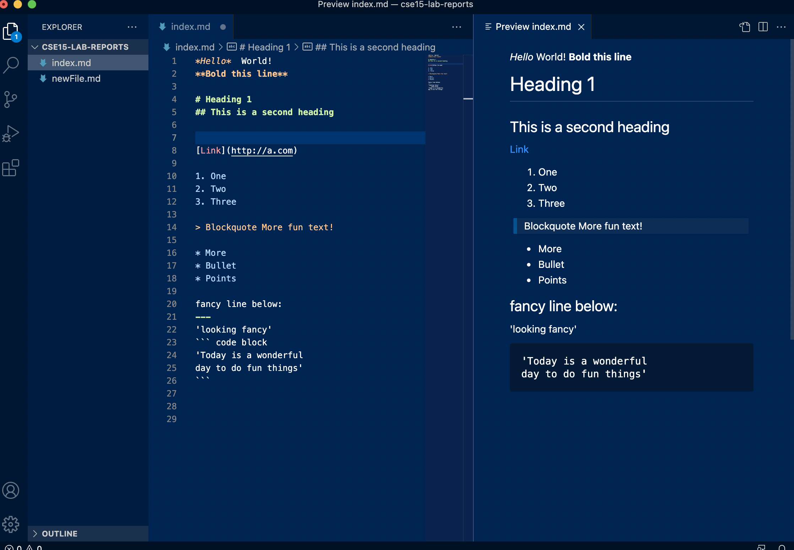

## LAB 1 REPORT
                                                                 
# Installing VSCode
---
Dowloading VSCode was quite simple. I followed the link posted on the lab guidelines and downloaded the version for MAC.
When istallation was complete, this was my view:

# Remotely Connecting
---
The first step in remotely connecting was to locate my CSE account and update my password. Once that was settled I entered
the `ssh` command in a new terminal to remotely connect to my server. I was prompted for a password and upon entering it, I connected!

# Trying Commands
---
I started playing around with some basic terminal commands. Different `ls` commands show different amounts of detail. Also, some commands
were unsuccessful such as `cat` and `cp`. These commands may not work on the client computer but they **DO** work on the server.

# Moving Files with `scp`
---
Next, I created file called WhereAmI.java on my computer in VSCode. Since this file exists on my computer I need to copy it over to the remote
server using an `scp` command. I copied the WhereAmI.java file over to my ieng6 and when I logged back into the server and hit `ls` my file
had transfered over!

# Setting an SSH Key
---

# Optimizing Remote Running
---

