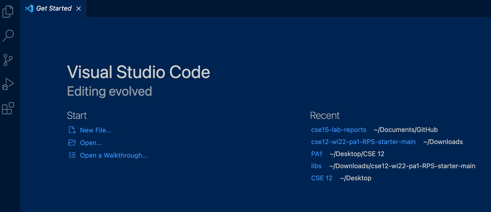
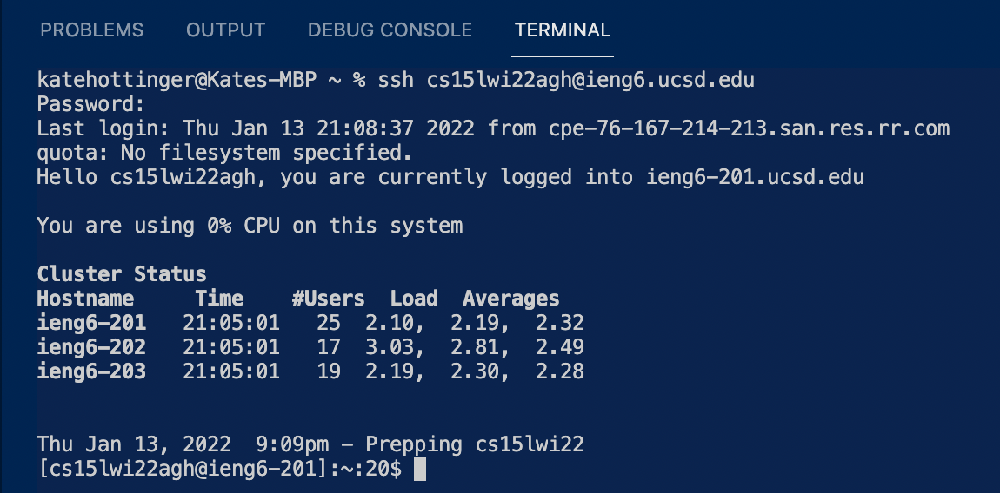
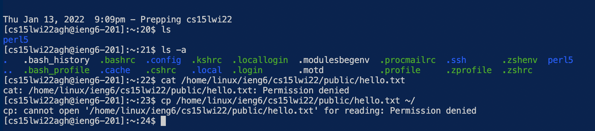
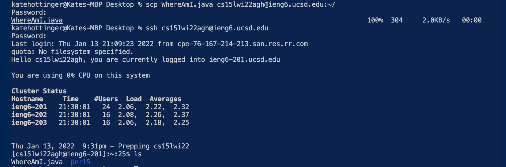
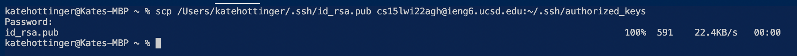
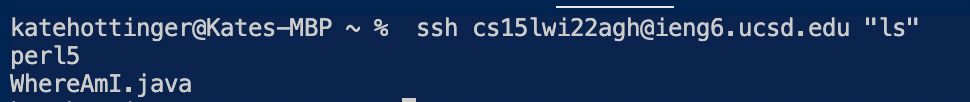

# LAB 1 REPORT
---
                                                                 
# Installing VSCode
---
Dowloading VSCode was quite simple. I followed the link [Download VSCode](https://code.visualstudio.com/) posted on the lab guidelines and downloaded the version for MAC. I went ahead and chose a theme for my environment. When istallation was complete, this was my view:

# Remotely Connecting
---
The first step in remotely connecting was to locate my CSE account and update my password [Find CSE Account](https://sdacs.ucsd.edu/~icc/index.php) Once that was settled I entered the `ssh` command in a new terminal to remotely connect to my server. I was prompted for a password and upon entering it, I connected:

# Trying Commands
---
I started playing around with some basic terminal commands. Different `ls` commands show different amounts of detail. Also, some commands
were unsuccessful such as `cat` and `cp`. These commands may not work on the client computer but they **DO** work on the server.

# Moving Files with `scp`
---
Next, I created file called WhereAmI.java on my computer in VSCode. Since this file exists on my computer I need to copy it over to the remote
server using an `scp` command. I copied the WhereAmI.java file over to my ieng6 and when I logged back into the server and hit `ls` my file
had transfered over:

# Setting an SSH Key
---
The first step in setting an SSH key was to create it with `ss-keygen`. I saved it into the file I wanted and then logged into my server. Then
I input the command `mkdir .ssh` and then logged off the server. On my client I then used `scp` to copy over the public key to my account on the
server. I sent this command and saw that it successfully went through:

# Optimizing Remote Running
---
In order to test if my SSH key was successful I ran an `ls` command to see if it would directly run on the server without me having to enter a password. By adding th quotation marks I ran the command directly on the server. In my terminal the `ls` command successfully showed the files in 
my server without requiring my password, great success!

