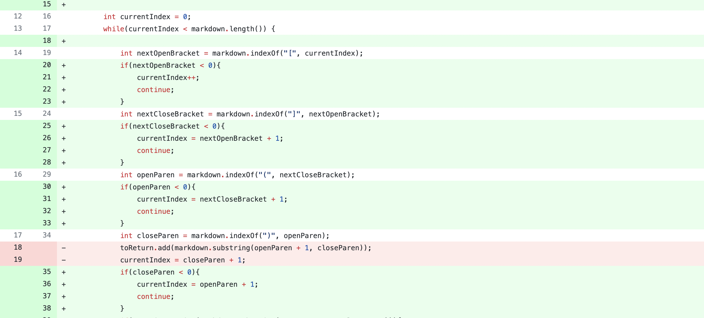
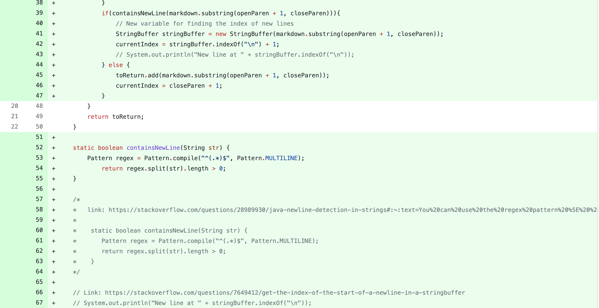

# Lab Report Week 4

## Code Change 1 (Missing a ")" at end of link)
Screenshot of Code change:

Link to failure inducing input 1: [Here](https://github.com/khottinger/markdown-parse/commit/49ff87ac817fb5e9f07909e61cb209abef258ac6)

## Code Change 2 (Blank line followed by random text)
Screenshot of Code change:

Link to failure inducing input 2: [Here](https://github.com/khottinger/markdown-parse/blob/main/test-file2.md)

## Code Change 3 (Blank line followed by empty () and then random text)
Screenshot of Code change(edits made @ same time as code change 1:

Link to failure inducing input 3: [Here](https://github.com/khottinger/markdown-parse/blob/main/test-file3.md)

