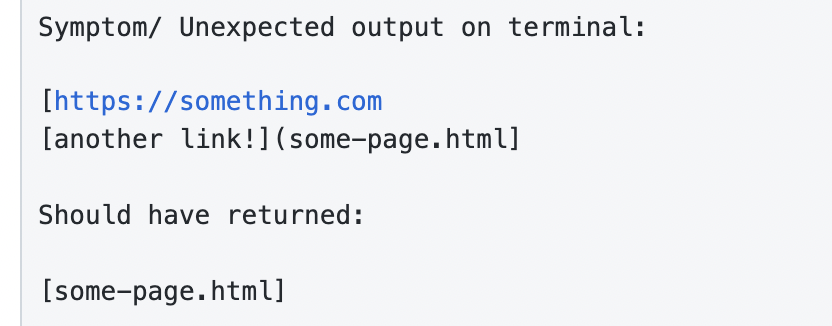
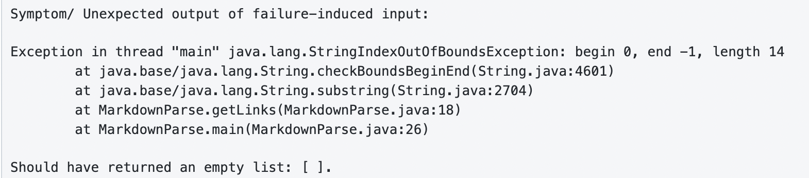
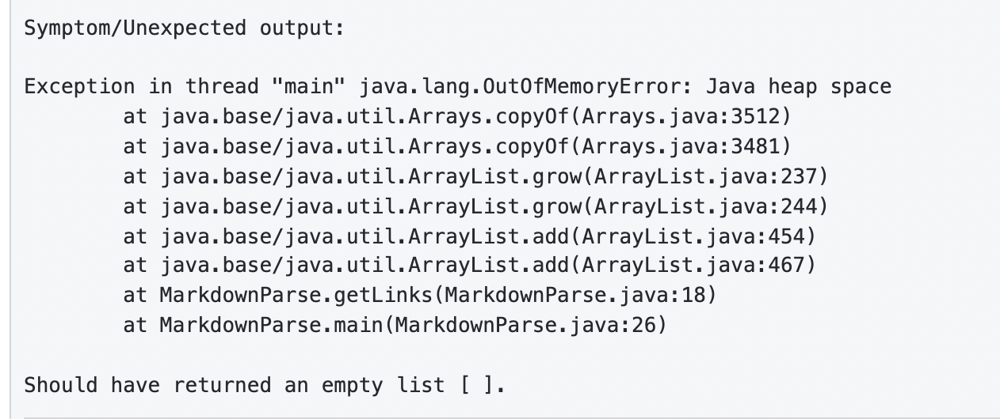

# Lab Report Week 4
(Repository forked from group member who screen-shared majority of edits in Lab)

---

## Code Change 1 
**Screenshot of Code change:**

**LINK 1** [FAILURE-INDUCING INPUT 1](https://github.com/khottinger/markdown-parse/commit/49ff87ac817fb5e9f07909e61cb209abef258ac6)

**SYMPTOM**
(zoomed in screenshot from commit page)

**RELATIONSHIP** :
---
Our first file we used to break our program was edited by removing a closed parenthesis. This ended up being a failure inducing input because `test-file1.md` 
caused a bug that was producing the symptom of incorrect output. The symptom showed up because of a bug in our `while-loop`, causing 
`toReturn.add(markdown.substring(openParen + 1, closeParen))` to return the entire first line of the file, even when there was a missing parenthesis. The failure
inducing input we fed our program created a bug in a specific line of our code that caused us to see incorrect output when we ran our program.

---

## Code Change 2 
**Screenshot of Code change:**

**LINK 2** [FAILURE-INDUCING INPUT 2](https://github.com/khottinger/markdown-parse/commit/66dbbb318b325cb80212f91e721cc292f98f09d3)

**SYMPTOM**
(zoomed in screenshot from commit page)

**RELATIONSHIP**
---
In `test-file2.md` we purposely broke our program by adding random text. The symptom (Exception) we recieved was
`java.lang.StringIndexOutOfBoundsException: begin 0, end -1, length 14`. We found that our `openParen` and `closeParen` were assigned the values -1 because
there was no parenthesis within our failure inducing input `test-file2.md`. This bug within our code was the reason `toReturn` wasn't recieveing the input 
expected so we recieved the symptom of `java.lang.StringIndexOutOfBoundsException`.

---

## Code Change 3 
**Screenshot of Code change:**

**LINK 3** [FAILURE-INDUCING INPUT 3](https://github.com/khottinger/markdown-parse/commit/73796a9bc16b5e7fb643f8888641479322567b58)

**SYMPTOM**
(zoomed in screenshot from commit page)

**RELATIONSHIP**
---
From our `test-file3.md` our failure inducing input was causing a `java.lang.OutOfMemoryError: Java heap space`. This led us to believe that somewhere in our 
program was a bug that was causing our while-loop to get stuck in an infinite-loop and therfore the memory ran out of room. It took awhile to find but we 
realized `currentIndex < markdown.length()` would always be true since `currentIndex` would always be less than the length of what was in out `test-file3.md`
when we only had parenthesis and no brackets.

