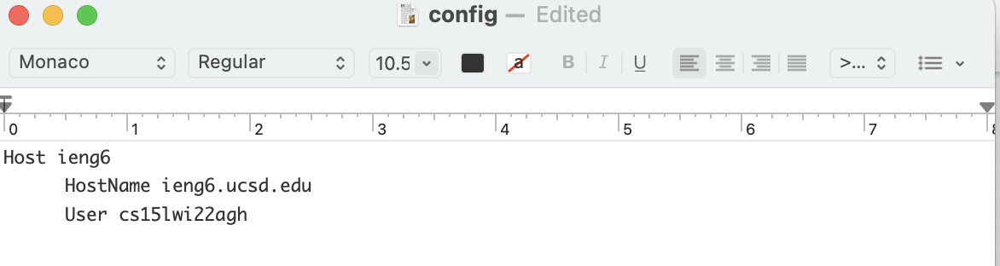
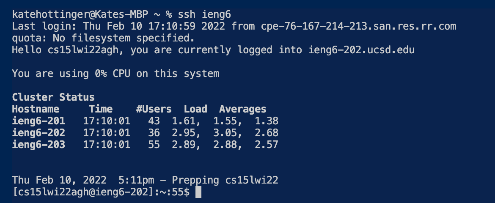

## LAB REPORT 3
---

## Streamlining ssh Configuration
---

# Creating `.ssh/config` file

The first step in streamlining my login was to create a `.ssh/config` file. I did not have one originally so I created one using Text Editor and input
all of my information. I did **not** have to add the `id_rsa` file, as the file I set-up worked the first time.

 

# Logging In!

With the simple command of `ssh ieng6` I was able to login without using my password. This saved me lots of time in my skill demo video!

