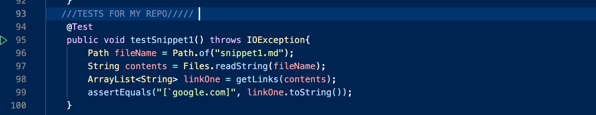
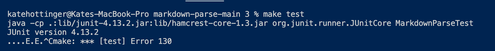
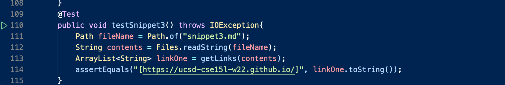
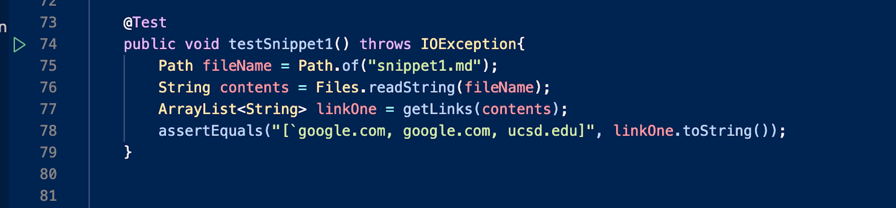
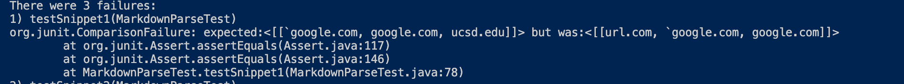
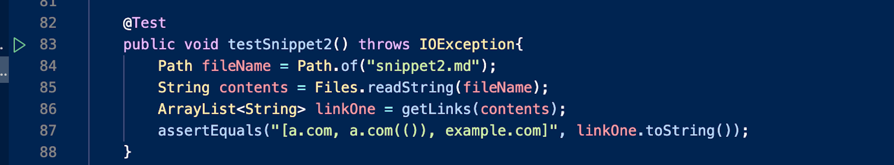
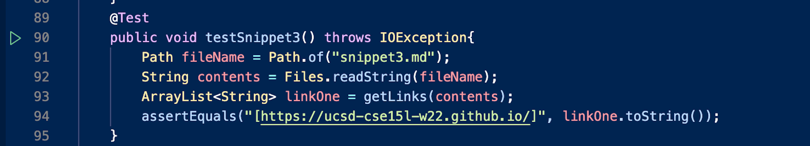
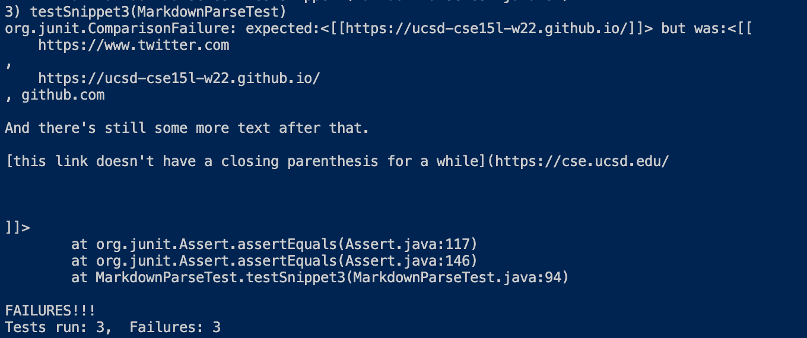

# LAB REPORT 4

[My MarkdownParse](https://github.com/khottinger/markdown-parse/tree/main)

[Reviewed MarkdownParse](https://github.com/yi113/markdown-parse/blob/main/MarkdownParse.java)

# My Implementation 
### Snippet 1

The image below shows the written JUnit test in `MarkdownParseTest.java` for snippet 1.

The image below shows the output, this test caused an infinite loop when I ran `make test` , I had to exit with contrl c and got this.

For snippet one, I think there could be a small code change that could prevent the infinite loop. Since my code was stuck in an infinite loop I assume it is similar 
to the problem Professor had in lecture, where the value of currIndex should have been checking for -1. However, I am not sure if once we find a way to get out of
the infinite loop that the test will produce the correct output. However, based on the output I recieved, I think a small code change would enable this test to 
exit the infinite loop and continue running.

### Snippet 2

The image below shows the written JUnit test in `MarkdownParseTest.java` for snippet 2.

The image below shows the output, this test caused an infinite loop when I ran `make test` , I had to exit with contrl c and got this.

For snippet two, even while running only the snippet 2 test, my output was also an infinite loop. Similar to my answer above, I think a small code change could be 
made to prevent an infinite loop as I believe it is caused by the indices. I think I would possibly need a few addittional lines of code to account for backticks 
once I find a way out of the infinite loop, but that is hard to say because I haven't been able to see the output because I am caught in an infinite loop, however
I think the infinite loop would be relatively short (in terms of code length) to fix.

### Snippet 3

The image below shows the written JUnit test in `MarkdownParseTest.java` for snippet 3.

The image below shows the output, this test caused an infinite loop when I ran `make test` , I had to exit with contrl c and got this.

Once again this individual test caused an infinite loop. It was rather a bummer to see but it makes me even more confident that the same issue is affecting every
test, no matter the input I am giving. I believe a short length of code would be able to fix this problem as I believe it is a bug within `MarkdownParse` 
`getLinks` method, and the way it is processing indices in the while loop. I think a short chunk of code is all that is needed because generally whne things are
stuck in an infinite loop, the bug causing the infinite loop is usually in a single(maybe more) line of code that doesn't require a large chunk of code to fix.

# Peer Reviewed Implementation
### Snippet 1

The image below shows the written JUnit test in `MarkdownParseTest.java` for snippet 1.

The image below shows the output, this test caused an infinite loop when I ran `make test` , I had to exit with contrl c and got this.

### Snippet 2

The image below shows the written JUnit test in `MarkdownParseTest.java` for snippet 2.

The image below shows the output, this test caused an infinite loop when I ran `make test` , I had to exit with contrl c and got this.

### Snippet 3

The image below shows the written JUnit test in `MarkdownParseTest.java` for snippet 3.

The image below shows the output, this test caused an infinite loop when I ran `make test` , I had to exit with contrl c and got this.

