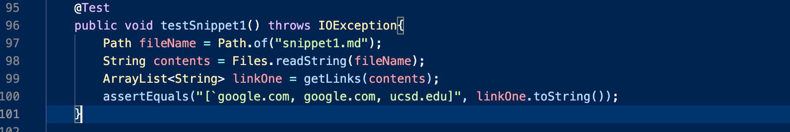
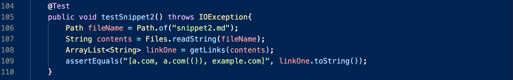
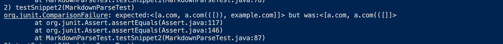

# LAB REPORT 4

[My MarkdownParse](https://github.com/khottinger/markdown-parse/tree/main)

[Reviewed MarkdownParse](https://github.com/yi113/markdown-parse/blob/main/MarkdownParse.java)

# My Implementation 
### Snippet 1

The image below shows the written JUnit test in `MarkdownParseTest.java` for snippet 1.

The image below shows the output, this test caused an infinite loop when I ran `make test` , I had to exit with contrl c and got this.

For snippet one, I think there could be a small code change that could prevent the infinite loop. Since my code was stuck in an infinite loop I assume it is similar 
to the problem Professor had in lecture, where the value of currIndex should have been checking for -1. However, I am not sure if once we find a way to get out of
the infinite loop that the test will produce the correct output. However, based on the output I recieved, I think a small code change would enable this test to 
exit the infinite loop and continue running.

### Snippet 2

The image below shows the written JUnit test in `MarkdownParseTest.java` for snippet 2.

The image below shows the output, this test caused an infinite loop when I ran `make test` , I had to exit with contrl c and got this.

For snippet two, even while running only the snippet 2 test, my output was also an infinite loop. Similar to my answer above, I think a small code change could be 
made to prevent an infinite loop as I believe it is caused by the indices. I think I would possibly need a few addittional lines of code to account for backticks 
once I find a way out of the infinite loop, but that is hard to say because I haven't been able to see the output because I am caught in an infinite loop, however
I think the infinite loop would be relatively short (in terms of code length) to fix.

### Snippet 3

The image below shows the written JUnit test in `MarkdownParseTest.java` for snippet 3.

The image below shows the output, this test caused an infinite loop when I ran `make test` , I had to exit with contrl c and got this.

Once again this individual test caused an infinite loop. It was rather a bummer to see but it makes me even more confident that the same issue is affecting every
test, no matter the input I am giving. I believe a short length of code would be able to fix this problem as I believe it is a bug within `MarkdownParse` 
`getLinks` method, and the way it is processing indices in the while loop. I think a short chunk of code is all that is needed because generally whne things are
stuck in an infinite loop, the bug causing the infinite loop is usually in a single(maybe more) line of code that doesn't require a large chunk of code to fix.

# Peer Reviewed Implementation
### Snippet 1

The image below shows the written JUnit test in `MarkdownParseTest.java` for snippet 1.

The image below shows the output, this test failed when I ran `make test`

The groups code we reviewed performed slightly better than ours because they clearly failed the test. I think a small chunk of code is able to fix this issue
because it was decently close to the expected output. I think their code probably needs a few lines of code to account for backticks within the brackets.
Based on the output and the input snippet, if they were to account for backticks primarily inside of the link brackets, they would have picked up the right 
URLS.

### Snippet 2

The image below shows the written JUnit test in `MarkdownParseTest.java` for snippet 2.

The image below shows the output, this test failed when I ran `make test` 

This groups code had very close outputs to the ones expected for snippet 2. I do think a small chunk of code would be able to fix this output, because they had
all the correct output until they had to handle what Joe called escape brackets that were randomly scattered within the links brackets. I think a small amount of
code could fix this issue because the biggest problem was that the code exited too early once it found the other `]`. I think if this group went back in and tried
to account for these extra brackets, the test would then pass.

### Snippet 3

The image below shows the written JUnit test in `MarkdownParseTest.java` for snippet 3.

The image below shows the output, this test failed when I ran `make test` 

This groups test failed pretty badly when I ran it. I think this test case may require a larger section of code because the output was very far from the expected.
Their code included text that was not within brackets or parenthesis and also included blank lines in the output. This test practically included the entire test 
snippet and I think this would take multiple sections of code changes to fix. This is because there are multiple breaking cases that are unaccounted for in their 
`MarkdownParse.java` which will need lots of code to fix because of the sheer number of cases they need to account for to get this test to pass.

