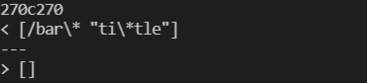
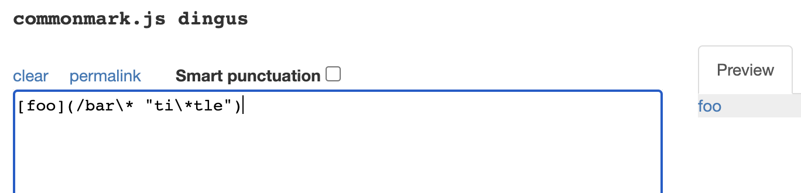
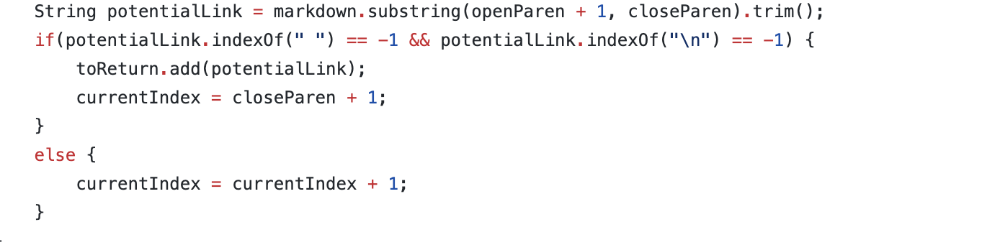
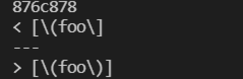
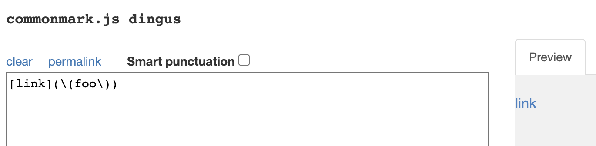
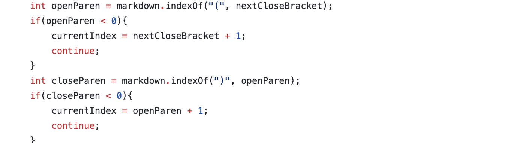

# LAB REPORT 5

In this lab we worked with 2 different implementations of markdown-parse

[Professor's Implementation, from lab 9](https://github.com/ucsd-cse15l-w22/markdown-parse)

[My Lab Groups Implementation](https://github.com/khottinger/markdown-parse)

## Bug One

**Difference in outputs:**

**How I found the different outputs:**

From the Lab guide I used the command `bash script.sh > results.txt` to create two text files to store the test results from both repositories.
I used `diff markdown-parse/results.txt cse15l-markdown-parse/markdown-parse/results.txt` command to find the different results in the two repositories.

**Which Implementation is correct?**

I found that both implementations were incorrect. I found this by using the [CommonMarkDemo](https://spec.commonmark.org/dingus/) website to see what the correct
output should have been. In this case the output expected was `foo` with a hyperlink to `ti*tle` , showing that both implementations were incorrect.

**What is wrong with the program?**

From Professor's implementation(via github) we see that the code does not account for spaces within links. In the scenario when we are handling a file with contents
`[foo](/bar\* "ti\*tle")` there are spaces. Because there are spaces in our `potentialLink` the String will NOT be added, this is why the incorrect output of
`[]` happened. To fix this problem you could change the condition under which a String gets added because a link can still be a link even if there are spaces, 
meaning we should change the code to not skip over content that has spaces.

## Test Two

**Difference in outputs:**

**How I found the different outputs:**

From the Lab guide I used the command `bash script.sh > results.txt` to create two text files to store the test results from both repositories.
I used `diff markdown-parse/results.txt cse15l-markdown-parse/markdown-parse/results.txt` command to find the different results in the two repositories.

**Which Implementation is Correct?**

I found that both my implementation and Professor's implementation were incorrect. I found this by using the [CommonMarkDemo](https://spec.commonmark.org/dingus/) website and saw that the expected output was a `link` with a hyperlink to `foo`. Unfortunately, both implementations had the incorrect contents.

**What is wrong with the program?**

Instead of looking at the Professors implementation, this time I will review my program. In my implementation, when my coode finds the first `(` it then searches 
for the first occurrence of `)`. When it finds the closed parenthesis it stops looking through the rest of the String. When given the contents `[link](\(foo\))`
My program iterates from the first `(` and iterates until it finds the first `)` and returns the contents within those characters. This is why my code returned
`\(foo\` as the link. I think once way to possibly fix this code would be too search for contents within the last open parenthesis to the first closed parenthesis.
This way my code would ignore the `\(` before `foo`. I think I would also need to add some code to ignore `\` within Strings because the correct output was `foo` 
while mine was `\(foo\`, so I would still need to find a way to get rid of the extra backslash in my output after my suggested fix, that way I can get the right
output of `foo` within my link.

